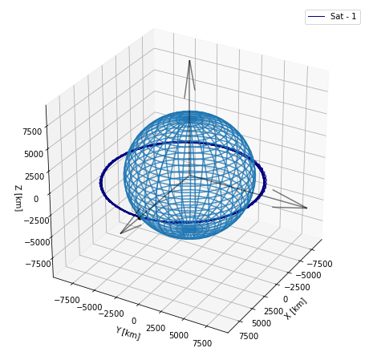
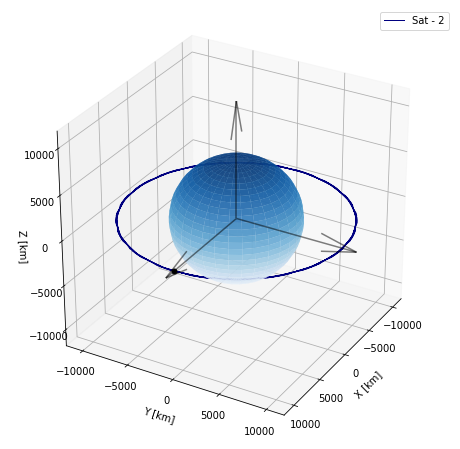
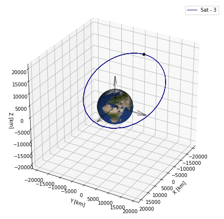
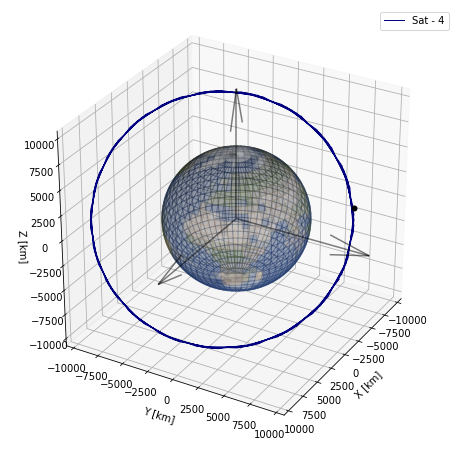
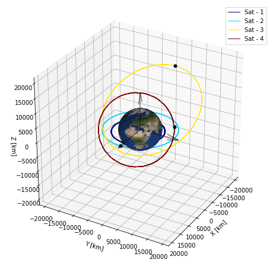
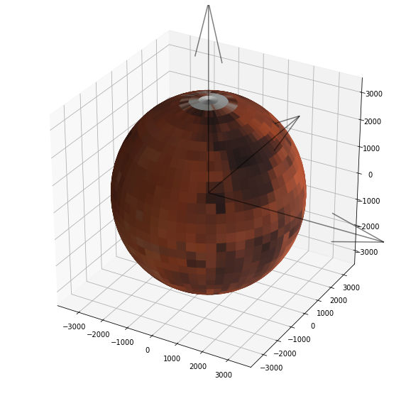
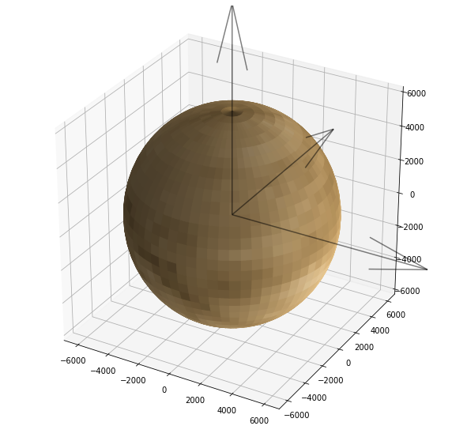

```python
from IPython.display import HTML, Image
```


```python
import numpy as np
import matplotlib.pyplot as plt

from py2body import Body, Orbit, earth
from py2body import visualization as vis
```


```python
dt = 600
n_steps = 100
```


```python
body_1 = Body(name='Sat - 1',
              position=[earth['radius']+3000, 0, 0],
              velocity=[0, 6, 0])

orbit_1 = Orbit(body_1, mu=earth['mu'], dt=dt, n_steps=n_steps)
orbit_1.propagate()

vis.plot_orbit(orbit_1, draw_sphere=True, texture='wire_frame')
```





```python
body_2 = Body(name='Sat - 2',
              position=[earth['radius']+5000, 0, 0])

orbit_2 = Orbit(body_2, mu=earth['mu'], dt=dt, n_steps=n_steps)
orbit_2.propagate()

vis.plot_orbit(orbit_2, draw_sphere=True, texture='surface')
```





```python
altitude = 18000
lon, lat = 180, 30

lon, lat = np.deg2rad(lon), np.deg2rad(90 - lat)
x = (earth['radius'] + altitude) * np.sin(lat) * np.cos(lon)
y = (earth['radius'] + altitude) * np.sin(lat) * np.sin(lon)
z = (earth['radius'] + altitude) * np.cos(lat)

position = [x, y, z]
velocity = [0, -3.0, 0]

body_3 = Body(name='Sat - 3', position=position, velocity=velocity)

orbit_3 = Orbit(body_3, mu=earth['mu'], dt=dt, n_steps=n_steps)
orbit_3.propagate()

vis.plot_orbit(orbit_3, draw_sphere=True, texture='earth')
```





```python
elements = {
    'a': earth['radius'] + 5000,
    'e': 0.1,
    'i': 60,
    'true_anomaly': 0,
    'argument_of_periapsis': 0,
    'longitude_of_ascending_node': 130
}

body_4 = Body(name='Sat - 4', elements=elements, mu=earth['mu'])

# dt = 60
# n_steps = int(iss.period // dt)

orbit_4 = Orbit(body_4, mu=earth['mu'], dt=dt, n_steps=n_steps)
orbit_4.propagate()

vis.plot_orbit(orbit_4, draw_sphere=True, texture='earth', texture_alpha=0.25)
```





```python
orbits = [orbit_1, orbit_2, orbit_3, orbit_4]

vis.plot_orbit(orbits, draw_sphere=True, texture='earth')
```





```python
ani = vis.animate_orbit(orbits, draw_sphere=True, texture='earth', rotate=True,
                        show=False, save=True, save_type='gif', filename='orbits.gif',
                        fig_size=(10, 10))

# HTML(ani.to_html5_video())
Image('orbits.gif')
```


```python
from py2body import jupiter

io_elements = {
    'a': (420e3 + 424e3) / 2,
    'e': 0.004,
    'i': 0.04,
    'true_anomaly': 0,
    'argument_of_periapsis': 0,
    'longitude_of_ascending_node': 0
}

europa_elements = {
    'a': (664e3 + 678e3) / 2,
    'e': 0.009,
    'i': 0.47,
    'true_anomaly': 0,
    'argument_of_periapsis': 0,
    'longitude_of_ascending_node': 0
}

ganymede_elements = {
    'a': (1068e3 + 1072e3) / 2,
    'e': 0.001,
    'i': 0.18,
    'true_anomaly': 0,
    'argument_of_periapsis': 0,
    'longitude_of_ascending_node': 0
}

callisto_elements = {
    'a': (1870e3 + 1896e3) / 2,
    'e': 0.007,
    'i': 0.19,
    'true_anomaly': 0,
    'argument_of_periapsis': 0,
    'longitude_of_ascending_node': 0
}

io = Body('Io', elements=io_elements, mu=jupiter['mu'])
europa = Body('Europa', elements=europa_elements, mu=jupiter['mu'])
ganymede = Body('Ganymede', elements=ganymede_elements, mu=jupiter['mu'])
callisto = Body('Callisto', elements=callisto_elements, mu=jupiter['mu'])

dt = 86400 / 8
n_steps = int(callisto.period / dt)

io_orbit = Orbit(io, mu=jupiter['mu'], dt=dt, n_steps=n_steps)
io_orbit.propagate()

europa_orbit = Orbit(europa, mu=jupiter['mu'], dt=dt, n_steps=n_steps)
europa_orbit.propagate()

ganymede_orbit = Orbit(ganymede, mu=jupiter['mu'], dt=dt, n_steps=n_steps)
ganymede_orbit.propagate()

callisto_orbit = Orbit(callisto, mu=jupiter['mu'], dt=dt, n_steps=n_steps)
callisto_orbit.propagate()

galilean_orbits = [io_orbit, europa_orbit, ganymede_orbit, callisto_orbit]

ani = vis.animate_orbit(galilean_orbits, draw_sphere=True, texture='jupiter',
                        sphere_radius=jupiter['radius'], texture_alpha=0.5,
                        rotate=True, interval=100, show=False, save=True,
                        save_type='gif', filename='galilean_orbits.gif')

# HTML(ani.to_html5_video())
Image('galilean_orbits.gif')
```


```python
fig = plt.figure(figsize=(10, 10))
ax = fig.add_subplot(projection='3d')

sph = vis.create_sphere(ax, texture='mars', radius=3389.5, texture_alpha=1)
```





```python
fig = plt.figure(figsize=(10, 10))
ax = fig.add_subplot(projection='3d')

sph = vis.create_sphere(ax, texture='venus', radius=6051.8, texture_alpha=1)
```





```python

```
